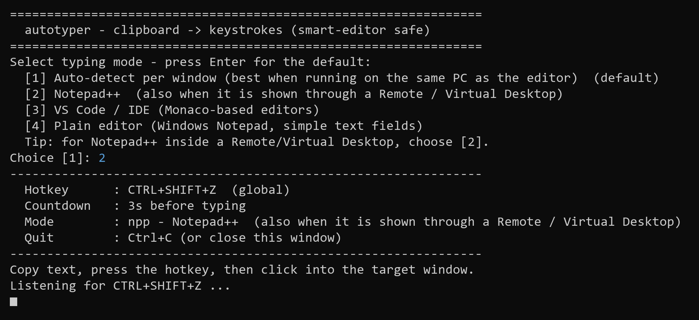

# autotyper

[](https://github.com/arglampedakis/auto_typer/releases/latest/download/autotyper.exe)
[](https://github.com/arglampedakis/auto_typer/releases/latest)
[](https://github.com/arglampedakis/auto_typer/actions/workflows/build.yml)
[](LICENSE)


A Windows clipboard auto-typer that types your clipboard into the focused
window character-by-character, producing **byte-for-byte identical** output
even in editors with auto-indent, auto-closing brackets/quotes, and
reindent-on-type (VS Code, IntelliJ, JSON editors, ...).



## Usage

**Option A — standalone .exe (no Python needed):** double-click **`build.bat`**
once to produce **`dist\autotyper.exe`**, then just run that exe. See
[Standalone .exe](#standalone-exe-no-python-needed) below. Copy the exe to any
Windows PC and run it — nothing to install.

**Option B — run from source:** the tool is **pure standard library** (no
third-party packages), so just:
```
python autotyper.py
```

Either way:

1. On launch it asks you to **pick a typing mode** (press Enter for
   auto-detect). See [Typing modes](#typing-modes) — this matters when the
   target is inside a Remote/Virtual Desktop.
2. Copy the text you want (it goes to the Windows clipboard).
3. Press **Ctrl+Shift+Z** (works even when the console isn't focused).
4. A `3... 2... 1...` countdown runs — click into your target window.
5. The clipboard is typed in. When it finishes, it listens again.
6. Press **Ctrl+C** in the console to quit.

### Typing modes

Different editors need slightly different keystrokes. At startup you choose:

| # | Mode | Use for |
|---|---|---|
| 1 | **auto** (default) | Auto-detect per window — best when autotyper runs on the **same PC** as the editor. |
| 2 | **npp** | **Notepad++**, including when it's shown through a **Remote / Virtual Desktop** (RDP/Citrix/VMware). |
| 3 | **ide** | VS Code and other Monaco-based IDEs. |
| 4 | **plain** | Windows Notepad and simple text fields. |

Skip the menu by passing the mode on the command line:
```
autotyper.exe --mode npp      # or: python autotyper.py --mode npp
```

**Why the mode matters for Remote/Virtual Desktops:** auto-detect inspects the
focused window. When you type into a remote-desktop client (RDP/Citrix/VMware),
the focused window is the *client*, not the editor inside it — so autotyper
can't tell it's Notepad++ and falls back to a mode whose Enter key the remote
Notepad++ autocomplete "eats" (dropping lines). Picking **npp** forces the
Unicode-newline path that the autocomplete can't intercept, so it works through
the remote session. (Alternatively, run `autotyper.exe` *inside* the virtual
desktop, where auto-detect works normally.)

## Standalone .exe (no Python needed)

**Download a prebuilt exe (no build needed):** every push is built on GitHub
Actions. Grab `autotyper.exe` from the **Actions** tab → latest `build` run →
*Artifacts*, or from a tagged **Release**. See
[Automated builds](#automated-builds-github-actions) below.

**Build it yourself** — a single plug-and-play executable you can copy to any
Windows PC:

1. Double-click **`build.bat`** (or run it from a terminal). It installs
   PyInstaller if needed and builds the exe.
2. The result is **`dist\autotyper.exe`** (~8 MB, self-contained).

Run it by double-clicking `autotyper.exe` — a console window opens showing the
countdown; the global **Ctrl+Shift+Z** hotkey works everywhere; **Ctrl+C** (or
closing the window) quits. No Python install required on the target machine.

Manual build command (equivalent to `build.bat`):
```
pyinstaller --onefile --console --name autotyper autotyper.py
```

### Automated builds (GitHub Actions)

`.github/workflows/build.yml` builds the exe on a Windows runner:

- **Every push / pull request** → the exe is uploaded as a downloadable
  artifact (Actions tab → the run → *Artifacts* → `autotyper-exe`).
- **Push a version tag** → a GitHub Release is created with the exe attached:
  ```
  git tag v1.0.0
  git push origin v1.0.0
  ```

### Antivirus

The tool is written to **not look like malware**: the global hotkey uses the
Win32 `RegisterHotKey` API (it does **not** install a keyboard hook, so it is
not a keylogger), the clipboard is read through the normal Win32 clipboard API,
and there are no third-party packages. The built `dist\autotyper.exe` passes a
Windows Defender scan clean (`MpCmdRun -Scan` → "found no threats").

If a stricter corporate antivirus still flags the single-file build (some
heuristics dislike PyInstaller's `--onefile` self-extraction to `%TEMP%`), build
a folder version instead — it runs in place with no temp extraction and is
flagged far less often:
```
pyinstaller --onedir --console --name autotyper autotyper.py
```
That produces `dist\autotyper\autotyper.exe` (ship the whole `dist\autotyper`
folder). As a last resort, add a Defender exclusion for the file/folder
(Windows Security → Virus & threat protection → Manage settings → Exclusions),
or run the exe **as Administrator** on locked-down machines.

### Editor auto-detection

Different editor families need different handling, so the tool inspects the
focused window and picks a profile automatically:

| Editor | Newline | Neutralise auto-indent/auto-close? |
|---|---|---|
| VS Code / IDEs (Monaco, Electron) | Enter key (`vk`) | yes |
| Notepad++ | Unicode `\n` (`char`) | yes |
| Windows Notepad / plain edit controls | Enter key (`vk`) | no (not needed) |

- Notepad++ uses a Unicode newline because its autocomplete popup *accepts a
  suggestion* when you press the Enter key while the popup is open (eating the
  line break); a Unicode newline is ignored by the popup.
- Plain editors don't auto-indent, so neutralisation is skipped entirely there
  (it would be pure risk with no benefit).

If a specific editor is misdetected, force behaviour with `NEWLINE_MODE`
(`"vk"`/`"char"`) and `NEUTRALIZE` (`True`/`False`) near the top of
`autotyper.py`. Tune `CHAR_DELAY` / `KEY_DELAY` there too if an app needs slower
input (Electron apps drop fast key events).

## Why it doesn't corrupt indentation

A naive auto-typer sends the **Enter/Tab virtual keys**. A smart editor reacts
to the Enter *key* by auto-indenting the new line to match the previous one;
your own leading spaces then stack on top, so indentation grows on every line
and the output drifts further right — the classic compounding-indent bug.

`autotyper.py` avoids this:

1. **Characters as Unicode, not keystrokes.** Every printable character *and
   every leading space* is injected as a raw Unicode code unit via the Win32
   `SendInput` API with `KEYEVENTF_UNICODE`. That's a pure "insert this
   character" event with no command semantics, so the editor can't interpret it
   as auto-indent/auto-complete input.
2. **Newlines are real Enters, but the auto-indent is stripped.** Monaco/Electron
   ignore a Unicode `\n`/`\r` keystroke entirely, so a real `Enter` (`VK_RETURN`)
   is required to break the line. Immediately after each Enter the auto-inserted
   indentation is selected (`End`, `Shift+Home`) and deleted, leaving a truly
   empty line; the line's *own* exact whitespace is then typed. Indentation
   therefore never compounds.
3. **Auto-closed partners are neutralized.** Right after an opener `( [ { " ' `` `
   a forward-`Delete` removes the partner the editor auto-inserted (a harmless
   no-op when nothing was inserted).
4. **Reindent-on-type is prevented, not repaired.** A line that *begins* with a
   closing bracket gets re-indented by smart editors the instant that bracket is
   typed. A throwaway sentinel digit is typed at column 0 first so the bracket is
   never the line's first non-whitespace character; the sentinel is then deleted.
   (Repairing afterwards isn't portable — `Home` means "first non-whitespace" in
   VS Code but "column 0" in Notepad/plain controls.)

Two implementation details that were essential for correctness:
- `sizeof(INPUT)` must be 40 bytes on x64 (the union must include `MOUSEINPUT`),
  or `SendInput` fails with `ERROR_INVALID_PARAMETER (87)`.
- `Home`/`End`/`Delete` must be sent with `KEYEVENTF_EXTENDEDKEY`, otherwise
  Windows can treat them as numpad keys and `Shift+Home` stops selecting.

## Test results (Windows 11, Python 3.12)

Verification typed a payload, read the result back (from disk for VS Code, from
the widget for Tkinter), and diffed against the source.

| Target | Payload | Result |
|---|---|---|
| VS Code (Monaco), `.sql` | 106-line nested SQL (parens, quotes, mixed indent) | **EXACT MATCH**, deterministic over multiple runs |
| VS Code (Monaco), `.json` | the nested JSON example | **EXACT MATCH** |
| Notepad++ | 106-line nested SQL | **EXACT MATCH** |
| Windows Notepad (Win11) | 106-line nested SQL | **EXACT MATCH** |
| Plain Tkinter Text (dumb-editor baseline) | SQL + JSON | **MATCH** |
| Full pipeline: real global **Ctrl+Shift+Z** → countdown → clipboard → VS Code | 106-line SQL | **EXACT MATCH** (5310 chars) |

Baseline (for contrast): typing the same SQL with a naive `VK_RETURN` newline +
no neutralisation reproduced the corruption seen in the field — compounding
indentation in VS Code/Notepad++ (4 → 8 → 16 → 24 ... spaces / tabs), and in
Notepad++ whole lines were *selected and deleted* because its autocomplete ate
the Enter key. Both are exactly what this tool now avoids.

## Project layout

```
autotyper.py       the whole tool (single file, standard library only)
build.bat          builds dist\autotyper.exe with PyInstaller
requirements.txt   runtime deps: none; PyInstaller listed for building
README.md          this file
LICENSE            MIT
```

The `.venv/`, `build/`, and `dist/` folders are build artifacts and are
git-ignored. Distribute the compiled `autotyper.exe` via **GitHub Releases**
rather than committing it to the source tree.

## Contributing

Issues and pull requests are welcome. Because the tool pokes at editor quirks,
the useful thing to include in a bug report is: the exact editor + version, the
input text, and what came out. If you add support for another editor, wire it
into `detect_profile()` and note how you verified it (type → save → diff).

Requirements to hack on it: Python 3.8+ on Windows. No third-party packages are
needed to run `autotyper.py`; PyInstaller is only needed to build the `.exe`.

## License

[MIT](LICENSE) © 2026 arglampedakis
